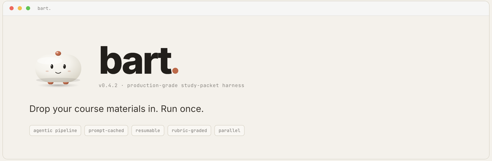
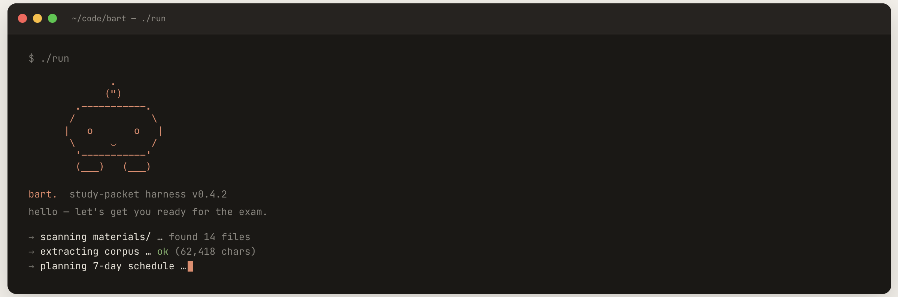

> Drop your course materials in. Run once.

---

bart reads your course materials and writes a personalized exam-prep packet — master plan, day-by-day lessons, schematics, mnemonics, a full practice exam, and a 60-minute review guide. Five Claude agents working in tandem.

```
              .
             (")
        .-----------.
       /             \
      |   o       o   |
       \      ‿      /
        '-----------'
        (___)   (___)

      hi — i'm bart.
```

```
   you   ──▶   drop pdfs in ./materials   ──▶   ./run   ──▶   open ./output
```

That's the whole thing.

---

## Try it locally first (no API tokens spent)

To verify bart is wired up before committing to a real run, drop the included sample fixture and dry-run:

```bash
cd bart
cp examples/sample_notes.md materials/
./run run --dry-run
```

This bootstraps the venv, runs the wizard once (any dummy values are fine), extracts the sample, builds the corpus, and stops *before* hitting the API. If you see the bart splash and a corpus summary with no errors, you're ready.

`./run doctor` verifies Python, deps, and your API key.

---

## 60-second start

**Step 1.** Put your course materials inside `bart/materials/`. The easiest way is to drag-and-drop them in Finder (macOS) or Explorer (Windows). Flat files or subfolders — both work.

If you prefer the terminal, replace `<PATH-TO-YOUR-NOTES>` below with the real path on your machine (run `pwd` inside the folder if you're not sure):

```bash
cd bart

# copy every file from your real notes folder into materials/, recursively
cp -R "<PATH-TO-YOUR-NOTES>"/. materials/

# example for a folder on the Desktop:
#   cp -R ~/Desktop/CHEM-201/. materials/
```

**Step 2.** Run bart:

```bash
./run
```

bart finds every supported file under `materials/` recursively. No globs, no filtering — drop it all in, bart sorts it out.

First run:

- Builds a Python venv.
- Installs deps.
- Asks for your API key, exam date, and what you want to focus on. (One time, takes 30 seconds.)
- Runs for ~10 minutes.
- Drops a study packet in `output/`.

Subsequent runs skip the wizard.

<p align="center">
  
</p>

<sub align="center"><i>what you see when you run <code>./run</code> — bart says hi, scans your materials, and gets to work.</i></sub>

---

## What you get

After one run, `output/run_<timestamp>/` looks like this:

```
output/run_2026-05-03_141503/
├── README.md                  ← packet index
├── 00_MASTER_PLAN.md          ← what to study, on what day, why
├── 01_SCHEMATICS.md           ← every diagram, formula table, and trap
├── 02_WHIMSICAL_NOTES.md      ← mnemonics and analogies that stick
├── 03_SHORT_STUDY_GUIDE.md    ← the 60-minute version
├── 04_PRACTICE_EXAM.md        ← full mock exam + answer key
└── daily_lessons/
    ├── Day_01_2026-05-04.md   ← 1000+ lines of dense, source-grounded study
    ├── Day_02_2026-05-05.md
    └── … one per day until exam day
```

Every file is markdown.

---

## How it differs from one-shot prompting

**Five agents, one packet.** Each has one job:

```
        ┌─────────────────┐
        │   your stuff    │
        └────────┬────────┘
                 │
        ┌────────▼────────┐
        │     Planner     │  reads everything, writes the master plan
        └────────┬────────┘
                 │
        ┌────────▼────────┐
        │   Researcher    │  for each day, finds the relevant bits
        └────────┬────────┘
                 │
        ┌────────▼────────┐
        │     Author      │  writes the lesson (long, dense, real)
        └────────┬────────┘
                 │
        ┌────────▼────────┐
        │     Critic      │  grades it 0–100, demands fixes
        └────────┬────────┘
                 │
        ┌────────▼────────┐
        │     Reviser     │  fixes anything that scored < 80
        └────────┬────────┘
                 │
              packet
```

Lessons are graded by a critic agent before they reach you. If a lesson is weak, it gets revised. You never see the bad draft.

**Source-grounded.** bart cites *your actual notes* — your textbook's notation, your past exams' problem numbers, your homework's vocabulary. No generic filler.

**Practice-heavy.** Every lesson ends with embedded Quick Checks (collapsible answers), worked examples, and 8–12 drill problems. The practice exam is a serious 3-hour mock with a real answer key.

---

## Commands

### Top-level subcommands

```bash
./run                       # generate a packet (alias for `./run run`)
./run --format [run_id]     # one-shot "make my packet pretty" — re-renders the HTML from
                            # markdown AND applies every safe autofix. Equivalent to
                            # `./run format --rerender --fix`. Defaults to the most recent run.
                            # Use this whenever you change CSS / templates, or to recover an
                            # output folder that picked up a renderer regression.
./run setup                 # re-run the configuration wizard
./run list                  # show every packet you've ever generated, with cost
./run doctor                # health check: Python, deps, auth, materials folder
./run render [run_id]       # rebuild HTML packet from existing markdown — no API calls.
                            # Defaults to the most recent run; pass an id to target a specific one.
./run format [run_id]       # audit every HTML page in a packet (KaTeX wired? math balanced?
                            # broken anchors? alt= on images? deprecated tags? mojibake?
                            # markdown leaks? library blocks intact?). Read-only by default.
                            #   --fix       apply safe in-place repairs
                            #   --rerender  rebuild from markdown first (picks up CSS/template changes)
                            #   --strict    exit non-zero on any warning (CI mode)
```

### Speed presets

```bash
./run                       # default — full quality (Opus + heuristic-gated review)
./run --fast                # Sonnet + no review. ~3-5x faster than default.
./run --turbo               # Maximum-speed — Haiku for top-level artifacts,
                            # Sonnet for daily lessons, no review, parallel=2.
                            # Best with subscription auth.
```

### Common flags

```bash
./run --resume <run_id>             # resume a crashed/interrupted run
./run --dry-run                     # extract + plan, stop before any API calls
./run --reconfigure                 # re-run setup wizard before this run
./run --no-critic                   # skip the review/revision loop
./run --max-parallel 8              # bump concurrent calls (default: 4 API, 2 subscription)
./run --days 14                     # override number of daily lessons (default: days-until-exam)
./run --model claude-sonnet-4-6     # one-off primary-model override
```

### Useful combinations

```bash
# Smoke test the install (no tokens burned):
cp examples/sample_notes.md materials/
./run --dry-run

# Fastest possible build (subscription mode):
./run --turbo

# Resume a crashed run (use `./run list` to find the run_id):
./run --resume run_2026-05-03_141503

# Limit to a 7-day plan, Sonnet quality, no review:
./run --fast --days 7

# Re-render the most recent packet after editing markdown:
./run render

# Re-render a specific past packet:
./run render run_2026-05-03_141503
```

---

## Re-rendering an existing packet

`./run render` rebuilds the HTML packet from markdown that's already on disk. **No API calls. No tokens spent.** Use it whenever you change anything in `bart/bart/render/` (CSS, KaTeX/mhchem loader, page template, design library blocks) and want the change to land on a packet you've already generated.

```bash
# Rebuild the most recent run:
./run render

# Rebuild a specific run (find the id with `./run list`):
./run render run_2026-05-03_141503
```

What `render` re-does:

- Re-reads every `.md` artifact under `output/<run_id>/`.
- Re-runs the sanitizer, markdown renderer, and design-library block expander.
- Copies fresh KaTeX + mhchem + brand assets into `<run_id>/lib/` and `<run_id>/assets/`.
- Re-applies the current `packet.css`, `blocks.css`, and the inline critical CSS.
- Re-builds `index.html`, `lessons/day_NN.html`, the search index, and the packet manifest.

It's idempotent: running it twice produces identical output. It never calls the API, so it's safe to loop while iterating on visuals.

### When equations or styling don't render

If LaTeX still looks like raw `\[…\]` source, or the page reverts to plain Inter instead of Source Serif 4, your *generated* HTML was produced by a previous version of the renderer. Just run `./run render` — the new code paths (broadened `has_math` detection, mhchem loader, critical-CSS `--font-serif` declaration, scoped `.katex-display` plate) will replace the stale output. The markdown source is untouched.

### When some daily lessons are missing

If the index page shows fewer day cards than the master plan listed (or the new orange "N day(s) did not generate" banner appears), the orchestrator hit a transient API error in a parallel worker. The day-level retry pass added in this version usually catches them in the same run; if it didn't, recover with:

```bash
./run --resume <run_id>
```

`--resume` skips every day file already on disk and only regenerates the missing ones. To find the run id, use `./run list` (or read it off the banner).

---

---

## Auditing a packet for formatting issues

`./run format` walks every HTML page under `output/<run_id>/` and runs ~20 structural / typographic / accessibility checks: KaTeX (and mhchem) actually wired when math markers are present, math delimiters balanced (no stray `\[`), no double-escaped LaTeX, no `<pre>` holding raw `\(…\)`, no markdown `[link](url)` syntax leaking through, every `href="#…"` resolves to an element id, every `` has alt text, no deprecated `<font>`/`<center>`, no encoding mojibake, no inline `font-size:` overrides fighting the global type scale, no zero-block lesson pages, no leftover ` ```bart-* ` fences, and so on.

```bash
# Read-only audit — see what's wrong:
./run format

# Auto-repair what's safe to repair (double-escaped math, unbalanced \[ blocks,
# inline font-size overrides, display math wrapped in <p>, lazy-load offscreen
# images), then audit again:
./run format --fix

# Rebuild HTML from markdown first, then audit:
./run format --rerender

# Combine for a one-shot "make it clean":
./run format --rerender --fix

# CI mode — exits non-zero on any warning:
./run format --strict
```

A full JSON report lands at `output/<run_id>/format_audit.json` with file path, line number, severity, and one-line summary for every issue. The console prints a tree grouped by file. A clean run prints `every page passes every check`.

---

### Environment variables

| Variable | Effect |
|----------|--------|
| `ANTHROPIC_API_KEY` | Used by API auth mode (also savable via `./run setup`) |
| `BART_DISABLE_STREAMING=1` | Disable stream-json output (use plain `--print` mode) |

### Running directly via Python

`./run` is a bash launcher that bootstraps the venv. If your venv exists you can also invoke the package directly:

```bash
.venv/bin/python -m bart                       # same as ./run
.venv/bin/python -m bart --turbo               # same as ./run --turbo
.venv/bin/python -m bart render run_xxxxx      # same as ./run render run_xxxxx
```

---

## Supported file types

| Type    | Notes                                                            |
| ------- | ---------------------------------------------------------------- |
| `.pdf`  | Textbook chapters, past exams, homework. bart extracts the text. |
| `.docx` | Word documents (paragraphs and tables).                          |
| `.pptx` | Lecture slides (text frames + tables).                           |
| `.md`   | Plain markdown notes.                                            |
| `.txt`  | Anything else plain text.                                        |

Unsupported file types are skipped with a clear message.

---

## How long does it take?

Total time scales with: number of days × model speed × review loop on/off × auth mode.

| Configuration                                | 7-day plan | 30-day plan |
| -------------------------------------------- | ---------- | ----------- |
| `--fast` (Sonnet, no review, parallel 8)     | ~3 min     | ~10 min     |
| API mode, Opus, no review                    | ~6 min     | ~20 min     |
| API mode, Opus, with heuristic-gated review  | ~9 min     | ~30 min     |
| Subscription mode, Opus, with review         | ~15 min    | ~55 min     |

Subscription mode is slower than API mode because there's no prompt caching — the corpus is re-processed on every call. If runtime matters, use `--fast` or set `primary_model` to `claude-sonnet-4-6` in your config.

Subsequent runs skip the venv build, and the disk cache makes repeat runs over the same materials nearly instant.

### What's optimized

**LLM-side (token / call savings):**

- Fused critic + reviser into a single Reviewer call.
- Reviewer doesn't carry the corpus — only the artifact + brief.
- Heuristic gate: artifacts that pass cheap structural checks skip the paid review.
- All Researchers run in parallel (Haiku) before Authors start.
- Tighter `max_tokens` ceilings match real artifact lengths.

**Browser-side (page-load):**

- MathJax (~1.2 MB) is lazy-loaded — only injected on pages that contain equations.
- Critical above-the-fold CSS is inlined; the full stylesheet loads non-blocking.
- HTML output is minified (~25-35% smaller).
- Search index is compacted JSON, prefetched on idle.
- After the first page, every subsequent page navigates instantly because shared assets (CSS, JS, MathJax) are cached.

---

## Cost

A 7-day plan with the full review loop costs roughly **$3–$10** in API tokens (down from $5–$15 in earlier versions thanks to several optimizations).

**Where the savings come from:**

- **Fused review.** Critic + Reviser merged into one Reviewer call that returns either "PASS" or a full revision inline. Saves a round-trip per artifact.
- **Corpus-free reviews.** The Reviewer doesn't see the corpus — it only needs the artifact + brief. Drops ~50% of input tokens per review.
- **Heuristic skip.** Cheap structural checks (length floors, math balance, AI-tell detection) decide whether an artifact even warrants a paid review. Healthy artifacts skip the Reviewer entirely.
- **Pre-fetched research.** All per-day Researchers run in parallel (Haiku, fast model) before the Authors start, eliminating a serial dependency.
- **Tighter `max_tokens`.** Output ceilings reduced to match real artifact lengths — fewer wasted tokens, faster generation.

**To spend even less:**

- `--fast` — Sonnet primary + no review + parallel 8. Roughly a quarter the cost of full Opus.
- `--no-critic` — Skip the review loop entirely.
- Edit `.bart_config.json` and set `primary_model` to `claude-sonnet-4-6` for a 5× speedup with marginal quality loss.

The disk cache means re-runs over the same materials are basically free. bart prints the exact cost when it finishes.

---

## Auth: API key *or* Claude subscription

bart supports two ways to talk to Claude:

**1. Claude Code subscription** *(recommended if you have Pro/Max/Team)*. If the `claude` CLI from [claude.ai/code](https://claude.ai/code) is on your PATH and you've logged in once, bart can route every call through it. No API key needed; usage is covered by your existing subscription. The setup wizard auto-detects this and offers it as the first option.

**2. Anthropic API key**. Get one at [console.anthropic.com](https://console.anthropic.com) (free credits on signup). Pay-per-token, but enables prompt caching and exact cost tracking. The wizard saves the key to `.bart_config.json` (mode `0600`, stays on your machine).

| | subscription mode | API mode |
|---|---|---|
| Per-run cost | $0 (covered by subscription) | $5–$15 typical |
| Setup | already done if `claude` is logged in | paste an API key once |
| Prompt caching | no (subscription tier handles speed) | yes |
| Cost telemetry | not tracked | exact USD per call |
| Rate limits | subscription tier | API tier |

You can switch between modes anytime with `./run setup`.

---

## Troubleshooting

**Interrupted mid-run.** Run `./run run --resume <run_id>` (use `./run list` to see ids). Completed artifacts are skipped; only the unfinished bits are regenerated.

**API errors.** bart retries with exponential backoff up to four times. After that, the error is logged to `output/<run_id>/run.log` and the run continues with what it has.

**A PDF extracts as garbage.** It's probably a scanned image. OCR it first (e.g. with `ocrmypdf`) and re-drop.

**A file was skipped.** The reason is printed alongside the skip. Usually unsupported extension or empty file.

**Anything else.** `./run doctor` checks Python, deps, your API key, and the materials folder.

---

## Configuration

Stored in `.bart_config.json`. Edit directly or rerun `./run setup`:

```json
{
  "api_key": "sk-ant-…",
  "exam_date": "2026-05-10",
  "subject": "Organic Chemistry II",
  "guidance": "weak on reaction mechanisms. 3 hrs/day available.",
  "student_level": "undergraduate",
  "style": "academic-rigorous",
  "daily_hours": 3.0,
  "primary_model": "claude-opus-4-7",
  "fast_model": "claude-haiku-4-5-20251001"
}
```

Swap `style` for a different voice. Swap `primary_model` for cheaper output. Swap `student_level` for different difficulty calibration. Changes apply on the next run.

---

## Customizing what bart writes

Every agent's system prompt is a markdown file in `prompts/`. Edit, save, run again. No code changes.

```
prompts/
├── planner.md       — how to build the day-by-day plan
├── researcher.md    — how to surface relevant corpus bits
├── author.md        — how to write the lessons
├── critic.md        — how to grade lessons
└── reviser.md       — how to apply critic feedback
```

---

## Project layout

```
bart/
├── run                  — bash launcher
├── requirements.txt
├── README.md
├── assets/              — SVG + ASCII brand assets
│   ├── bart-loaf.svg
│   ├── bart-wordmark.svg
│   └── bart-loaf.txt
├── bart/                — python package
│   ├── __main__.py      — CLI dispatcher
│   ├── branding.py      — color tokens + ASCII splash printer
│   ├── config.py        — pydantic config + setup wizard
│   ├── orchestrator.py  — pipeline orchestration
│   ├── llm.py           — API wrapper: caching, retries, telemetry
│   ├── telemetry.py     — token + cost accounting
│   ├── agents/          — planner / researcher / author / critic / reviser
│   ├── extractors/      — pdf / docx / pptx / text
│   └── io/              — corpus assembly + atomic writes
├── prompts/             — editable agent prompts
├── tests/               — pytest smoke tests
├── materials/           — drop course materials here
└── output/              — generated packets land here
```

Roughly 1800 lines of Python. Every module has one job.

---

## Tests

```bash
.venv/bin/pip install pytest
.venv/bin/python -m pytest tests/
```

Smoke tests cover corpus assembly and planner JSON parsing.

---

## Philosophy

1. **One command should do everything.** If you have to read a doc, the UX failed.
2. **Show the cost.** Every run prints exactly what it spent.
3. **Don't make things up.** If the corpus doesn't say it, bart doesn't say it. (And if a lesson does, the critic catches it.)

---

## Credits

Built with [Anthropic Claude](https://anthropic.com), [pypdf](https://pypdf.readthedocs.io), [python-docx](https://python-docx.readthedocs.io), [python-pptx](https://python-pptx.readthedocs.io), [Rich](https://github.com/Textualize/rich), and [Pydantic](https://pydantic.dev).

For students who would rather *learn* the material than spend three hours organizing their notes into a study schedule.

---

<p align="center">
  <br/>
  <sub></sub>
</p>
